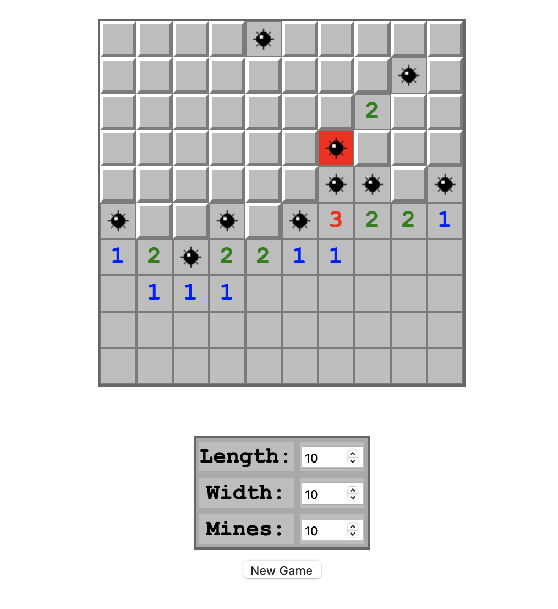
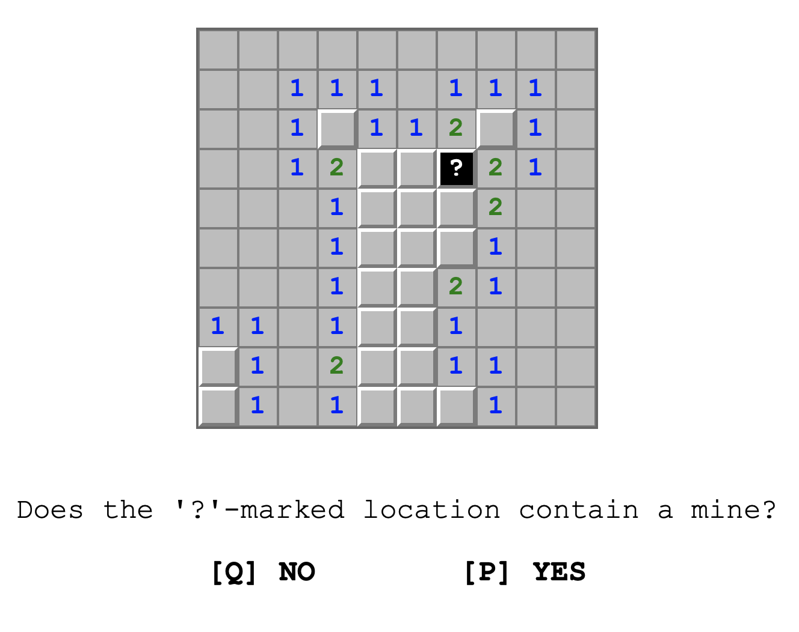

# Flask Minesweeper

This repository contains a simple implementation of the classic game Minesweeper, built with Flask, a lightweight WSGI web application framework in Python.



### Prerequisites

- Flask

You can install Flask using pip:

```bash
pip install flask
```

## Running the Application
Once Flask is installed, you can start the server by running app.py.

```bash
python app.py
```

The default path for the application is http://127.0.0.1:5000/ (for free gameplay).

## Reasoning experiment

To access the reasoning experiment go to http://127.0.0.1:5000/experiment.



### Game representation

JSON Data Structure

    Game Board (game_board): An NxM array where each element is an integer
    - -1 represents a mine.
    - 0 to 8 represent the number of adjacent mines.

    Game States (game_states): An array where each element is an object containing a game_state and a move.

    game_state (this is the information that players have access to) is an NxM array similar to game_board, but with:
    - 0 to 8 for uncovered squares.
    - -1 for unseen squares.
    - -2 for flagged squares.
    - -3 for squares that have been revealed to contain a bomb (this implies that the game has ended)

    move is an object with x, y, and action: x and y are the coordinates of the move. Action is either 0 (uncover) or 1 (flag).
