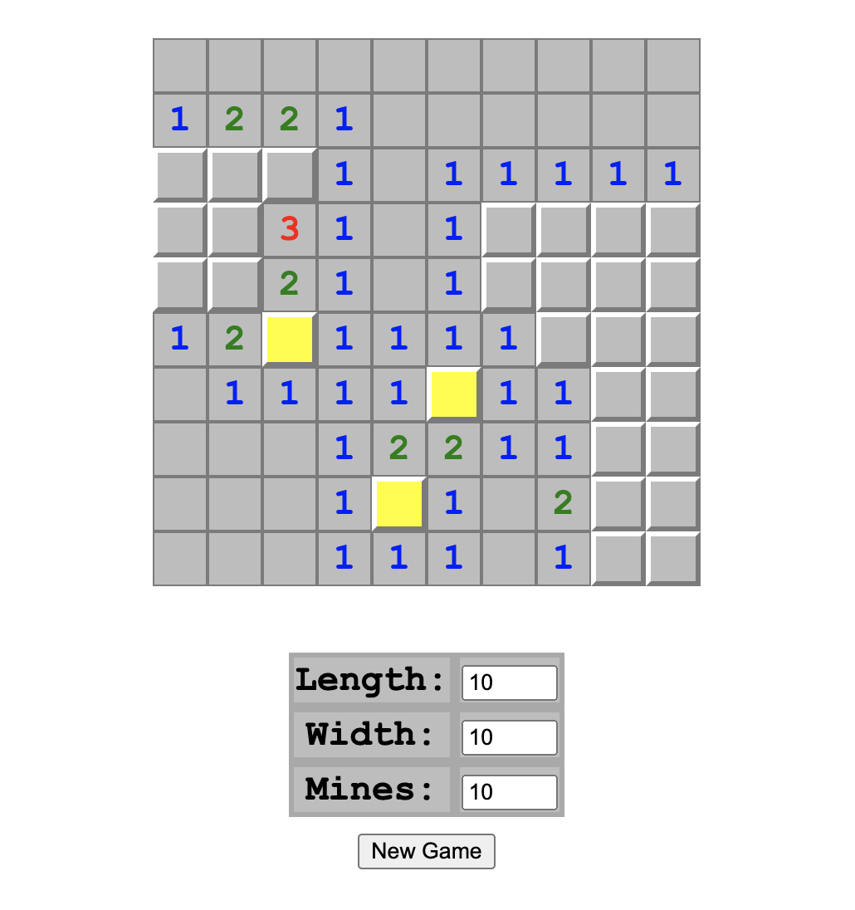

# Flask Minesweeper

This repository contains a simple implementation of the classic game Minesweeper, built with Flask, a lightweight WSGI web application framework in Python.



### Prerequisites

- Flask

You can install Flask using pip:

```bash
pip install flask
```

## Running the Application
Once Flask is installed, you can start the server by running app.py.

```bash
python app.py
```

The default path for the application is http://127.0.0.1:5000/.